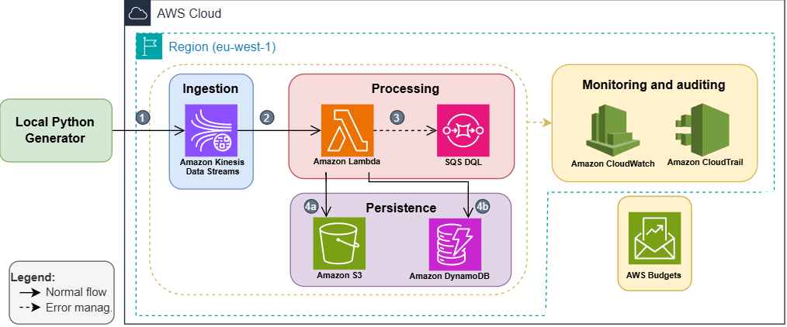
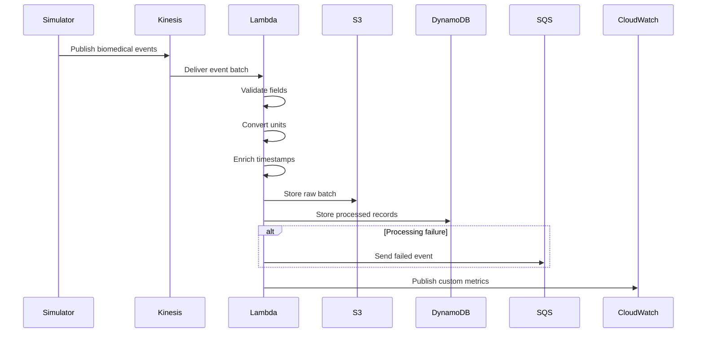

# System Architecture

>This document describes the cloud architecture implemented for the near real-time ingestion, processing, persistence, and monitoring of biomedical data generated by wearable devices.

---

## Table of Contents

* [Architectural Goals](#architectural-goals)
* [Design Principles](#design-principles)
* [Architecture Overview](#architecture-overview)
* [Components](#components)

  * [Biomedical Data Simulator](#biomedical-data-simulator)
  * [Amazon Kinesis Data Streams](#amazon-kinesis-data-streams)
  * [AWS Lambda](#aws-lambda)
  * [Amazon DynamoDB](#amazon-dynamodb)
  * [Amazon S3](#amazon-s3)
  * [Amazon SQS Dead-Letter Queue](#amazon-sqs-dead-letter-queue)
  * [Amazon CloudWatch](#amazon-cloudwatch)
  * [AWS CloudTrail](#aws-cloudtrail)
  * [AWS Budgets](#aws-budgets)
  * [Terraform](#terraform)
* [End-to-End Data Flow](#end-to-end-data-flow)
* [Scalability](#scalability)
* [Fault Tolerance](#fault-tolerance)
* [Summary](#summary)
* [Related Documentation](#related-documentation)
* [References](#references)

---

# Architectural Goals

The platform implements a fully serverless architecture designed to process continuous biomedical data streams generated by wearable devices for patient monitoring in non-critical hospital environments.

The architecture is designed to satisfy the following non-functional objectives:

| Goal            | Description                                                                                         |
| --------------- | --------------------------------------------------------------------------------------------------- |
| Low latency     | Maintain an end-to-end latency objective of **P95 < 10 seconds** under normal operating conditions. |
| Data integrity  | Keep event loss below **1%** during supported workloads.                                            |
| Scalability     | Adapt automatically to increasing event rates without manual infrastructure management.             |
| Observability   | Provide operational metrics and logs for monitoring pipeline behavior.                              |
| Cost efficiency | Minimize operational cost through managed cloud services and serverless execution.                  |

---

# Design Principles

The platform follows a small set of architectural principles that guide every component.

| Principle                      | Implementation                                                                                        |
| ------------------------------ | ----------------------------------------------------------------------------------------------------- |
| Event-driven processing        | Every sensor measurement is processed as an independent event.                                        |
| Serverless execution           | All cloud services are managed AWS services without server management.                                |
| Separation of responsibilities | Generation, ingestion, processing, persistence, and monitoring are implemented as independent layers. |
| Dual persistence               | Raw and processed data are stored independently to preserve traceability and reproducibility.         |
| Managed observability          | Monitoring, auditing, and operational cost tracking are implemented using native AWS services.        |
| Infrastructure as Code         | Infrastructure is defined declaratively using Terraform.                                              |

---

# Architecture Overview

The architecture is organized into five logical stages:

1. Event generation
2. Streaming ingestion
3. Event processing
4. Data persistence
5. Monitoring and operational management

The platform implements a fully serverless event-driven architecture for near real-time biomedical data processing.
Each stage has a clearly defined responsibility and communicates through managed AWS services.

The following diagram illustrates the complete cloud architecture and the interactions between all platform components.

The editable source of this diagram is available at `architecture/AWS_architecture.drawio`.

---

# Components

## Biomedical Data Simulator

### Purpose

Generate continuous biomedical events that reproduce the sampling frequencies and multimodal characteristics defined by the WESAD reference dataset.

### Responsibilities

* Generate continuous event streams.
* Emit events according to each sensor sampling frequency.
* Simulate heterogeneous wearable sensors.
* Record generated events locally for later integrity verification.

### Interactions

| Interacts With              | Purpose                                          |
| --------------------------- | ------------------------------------------------ |
| Amazon Kinesis Data Streams | Sends generated biomedical events for ingestion. |

---

## Amazon Kinesis Data Streams

### Purpose

Provide the streaming ingestion layer for continuous biomedical events.

### Responsibilities

* Receive events from the simulator.
* Buffer incoming event streams.
* Preserve temporal ordering for each partition key.
* Decouple event ingestion from downstream processing.
* Retain events for up to 24 hours for possible reprocessing.

### Interactions

| Interacts With            | Purpose                                        |
| ------------------------- | ---------------------------------------------- |
| Biomedical Data Simulator | Receives generated events.                     |
| AWS Lambda                | Delivers batches through Event Source Mapping. |

---

## AWS Lambda

### Purpose

Process biomedical events and persist both raw and enriched records.

### Responsibilities

* Validate event fields.
* Convert measurement units.
* Enrich records with processing timestamps.
* Persist raw data to Amazon S3.
* Persist processed data to Amazon DynamoDB.
* Send failed events to the Dead-Letter Queue.
* Publish custom metrics to Amazon CloudWatch.

### Interactions

| Interacts With              | Purpose                   |
| --------------------------- | ------------------------- |
| Amazon Kinesis Data Streams | Receives event batches.   |
| Amazon S3                   | Stores raw events.        |
| Amazon DynamoDB             | Stores processed events.  |
| Amazon SQS DLQ              | Stores failed events.     |
| Amazon CloudWatch           | Publishes custom metrics. |

---

## Amazon DynamoDB

### Purpose

Store processed biomedical events for operational access.

### Responsibilities

* Persist enriched event records.
* Support low-latency access using primary keys.
* Preserve idempotent writes through unique event identifiers.

### Interactions

| Interacts With | Purpose                     |
| -------------- | --------------------------- |
| AWS Lambda     | Receives processed records. |

---

## Amazon S3

### Purpose

Store the original biomedical events without modification.

### Responsibilities

* Preserve raw event data.
* Support future reprocessing.
* Maintain an immutable representation of incoming events.

### Interactions

| Interacts With | Purpose                         |
| -------------- | ------------------------------- |
| AWS Lambda     | Receives batches of raw events. |

---

## Amazon SQS Dead-Letter Queue

### Purpose

Capture events that cannot be processed successfully.

### Responsibilities

* Store failed events.
* Enable later inspection of processing failures.

### Interactions

| Interacts With | Purpose                 |
| -------------- | ----------------------- |
| AWS Lambda     | Receives failed events. |

> **Note**
>
> The platform stores failed events in the Dead-Letter Queue. Automatic reprocessing is not implemented.

---

## Amazon CloudWatch

### Purpose

Monitor the operational behavior of the platform.

### Responsibilities

* Collect custom pipeline metrics.
* Store operational logs.
* Support automatic alarms.
* Verify pipeline integrity by comparing event counts across processing stages.

### Interactions

| Interacts With | Purpose                  |
| -------------- | ------------------------ |
| AWS Lambda     | Receives custom metrics. |

---

## AWS CloudTrail

### Purpose

Provide infrastructure auditing.

### Responsibilities

* Record actions performed on AWS resources.
* Support operational traceability.

### Interactions

CloudTrail operates independently by recording activity across AWS resources.

---

## AWS Budgets

### Purpose

Monitor operational spending.

### Responsibilities

* Track cloud costs.
* Generate alerts when the monthly budget approaches configured thresholds.

### Interactions

AWS Budgets monitors the deployed AWS resources.

---

## Terraform

### Purpose

Provision the entire cloud infrastructure using Infrastructure as Code.

### Responsibilities

* Define infrastructure declaratively.
* Enable reproducible deployments.
* Version infrastructure configuration together with application code.

### Interactions

Terraform provisions the AWS resources that compose the platform.

---

# End-to-End Data Flow

The processing pipeline follows a linear event-driven workflow.

The architecture separates ingestion, processing, persistence, and monitoring, allowing each stage to evolve independently.

---

# Scalability

The architecture relies on managed AWS services to support increasing workloads.

Scalability characteristics documented for the platform include:

| Component                   | Scaling Behavior                                                              |
| --------------------------- | ----------------------------------------------------------------------------- |
| Amazon Kinesis Data Streams | Buffers incoming streams and distributes events across shards.                |
| AWS Lambda                  | Automatically increases concurrent executions according to incoming workload. |
| Amazon DynamoDB             | Uses on-demand capacity mode (`PAY_PER_REQUEST`).                             |
| Amazon S3                   | Provides scalable object storage for raw event persistence.                   |

The architecture also separates components through asynchronous streaming, preventing producers from being directly coupled to consumers.

---

# Fault Tolerance

Several mechanisms improve operational resilience.

| Mechanism             | Purpose                                                                           |
| --------------------- | --------------------------------------------------------------------------------- |
| Kinesis buffering     | Decouples producers from consumers and absorbs temporary load increases.          |
| Event retention       | Kinesis retains events for up to 24 hours to support reprocessing after failures. |
| Dead-Letter Queue     | Failed events are preserved for later analysis.                                   |
| Dual persistence      | Raw and processed datasets remain independently available.                        |
| CloudWatch monitoring | Detects abnormal pipeline behavior using metrics and alarms.                      |
| CloudTrail auditing   | Records operations performed on AWS resources.                                    |

> **Note**
>
> The platform stores failed events in the Dead-Letter Queue, but automatic replay is intentionally outside the current implementation.

---

# Summary

The platform implements a fully serverless, event-driven architecture that separates ingestion, processing, persistence, monitoring, auditing, and infrastructure provisioning into independent components.

The architecture uses managed AWS services to reduce operational complexity while supporting continuous biomedical data ingestion, preserving raw and processed datasets independently, and providing operational observability through native AWS monitoring services.

---

# Related Documentation

* `engineering-decisions.md`
* `methodology.md`
* `evaluation.md`
* `results.md`
* `limitations.md`

---

# References

* Amazon Kinesis Data Streams Developer Guide
* AWS Lambda Developer Guide
* Amazon S3 User Guide
* Amazon DynamoDB Developer Guide
* Amazon CloudWatch User Guide
* AWS X-Ray Developer Guide
* Amazon SQS Developer Guide
* AWS Well-Architected Framework
* WESAD: Wearable Stress and Affect Detection Dataset
